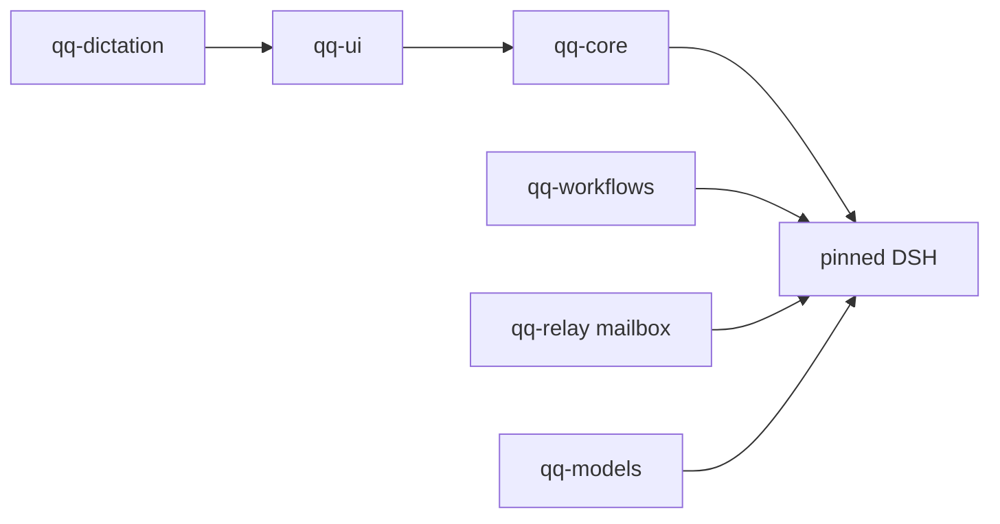

# Core host topology

`qq-core` is a repository and the daily DSH host. `bin/qq` loads core from its
own repository root and conditionally links sibling `qq-ui`, `qq-workflows`,
`qq-models`, `qq-relay`, and `qq-dictation` repositories. Independent
`image-finder` and `media-box` siblings are optional. No containing `qq`
checkout or catalog group exists.

Missing plugins do not block core boot. HMR watches exactly linked repository
roots. Project sessions use the selected repository root for both cwd and the
existing `workspace-write` boundary.
