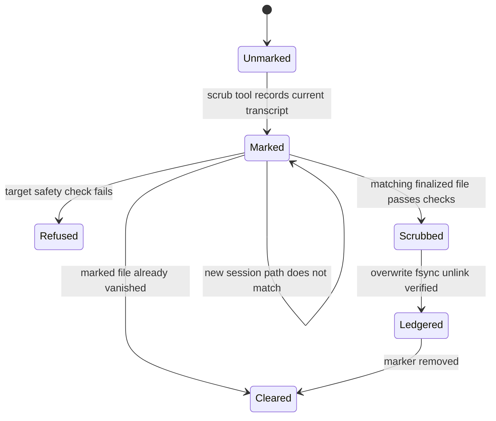
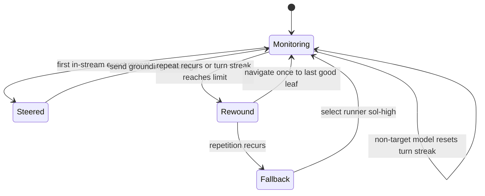

# Safety and context extensions

These globally registered Pi extensions constrain context growth and intercept unsafe or unproductive actions. Registration is centralized in the sibling `qq-pi` project (`extensions/index.ts` there); this page covers their local behavior rather than general runtime activation.

## Responsibilities and decisions

| Extension | Decision flow | Responsibility and limit |
|---|---|---|
| `read.ts` | Delegate first to Pi's built-in reader. Return image outcomes unchanged; otherwise honor `ranges`, then `offset`/`limit`, then return small text, then try `ast-outline`, finally return a bounded head/tail preview. | Replaces `read`; estimates one token per four UTF-16 code units and uses a 9,000-token ceiling for unsliced text and rendered fallbacks. Explicit slices are caller-controlled and are not subjected to that ceiling. Adjacent/overlapping ranges merge. |
| `backlog-guard.ts` | On `write` or `edit`, find the Git checkout root, normalize the requested path, and block targets under either `backlog/` or its resolved store path. | Forces managed Backlog Markdown changes through the Backlog CLI. It does not intercept other tools, non-Git directories, or paths outside the managed store. |
| `session-scrub.ts` | `mark_session_for_scrub` records the current transcript. Only a later `session_start` with reason `new` and an exactly matching previous path can scrub it. | Overwrites with random bytes, fsyncs, overwrites with zeros, fsyncs, unlinks, verifies absence, writes a content-free ledger entry, then clears the marker. It refuses the current session, non-owned/non-regular/symlink files, and files outside the Pi sessions root. |
| `grok-paraphrase-guard.ts` | For `grok-4.6`, detect either three exact adjacent blocks of 12–96 words in a stream or five similar completed turns. Abort, steer once for the first stream incident, then escalate recurrence to one rewind and finally `runner:sol-high`. | Bounds detector text, resets across sessions/tree changes, and never applies to another model. A missing rewind target stops safely; fallback model/auth/profile failures are reported rather than bypassed. |
| `continue.ts` | On `shift+alt+enter`, send `continue` only when `ctx.isIdle()` is true. | A convenience shortcut, not automatic retry or liveness management. |

The read extension preserves Pi's image behavior. For every request it first calls Pi's built-in reader, caching that tool definition per working directory so relative-path behavior stays scoped correctly. Local follow-up resolves an optional leading `@`, `~`/`~/`, absolute paths, or paths relative to `ctx.cwd`. `qq-pi/extensions/index.ts` lazily resolves MIME detection from either the Mario Zechner or Earendil Works Pi package seam; if neither implementation is available, MIME detection returns no match while built-in image content can still identify an image. Built-in errors and image/binary handling therefore happen before local UTF-8 text routing. Abort is checked before built-in work and after MIME detection; abort errors during outlining are rethrown, never converted to previews.

Explicit line reads are 1-indexed. `ranges` wins over `offset`/`limit`, clips ranges to the file, sorts and merges adjacent/overlapping spans, and fails when no span remains. An offset at or beyond the split line count fails with the total; a bounded slice adds a continuation hint when lines remain. These explicit reads intentionally bypass the 9,000-token cap.

Large unsliced text invokes `ast-outline <absolute-path> --json`. `fitOutline` requires tool `ast-outline`, command `outline`, no declared error, one file with finite `line_count`, recursively valid child arrays, and finite line ranges. It renders full declaration depth first, then collapses one depth at a time to zero; depth zero is returned even if unusually verbose. Missing executable, nonzero exit, unsupported language, malformed/invalid JSON, or an oversized deep outline falls back to 20 head and 10 tail lines. The fallback is then binary-searched to satisfy both `estimateTokens(text) <= budget` and UTF-8 bytes `<= budget * 4`, including huge multibyte lines.

## Scrub lifecycle



The marker authorizes only one exact, finalized previous-session path; refusal leaves evidence and data in place rather than broadening deletion scope.

## Grok recovery lifecycle



The first exact stream incident gets a three-completed-turn recovery window. A recurrence skips another steer and enters the same rewind/fallback escalation used by completed-turn similarity.

## Invariants and guarantee boundaries

- Built-in read classification runs before local text reading; actual MIME detection or an image content part—not status text alone—decides image delegation.
- AST output must identify `ast-outline`, the `outline` command, valid declarations, and line counts. Invalid, failed, missing, or unsupported outlines degrade to a bounded preview.
- Backlog path checks include Unicode-space normalization, `@`, home, and `file://` forms, but the guard is an agent-tool policy layer rather than an OS permission boundary.
- Scrubbing is best-effort logical destruction on the current filesystem. Overwrite and unlink do not promise erasure from snapshots, backups, journals, copy-on-write storage, prior copies, or already exported content.
- Grok recovery changes model, effort, role event, and status only through the declared execution policy; it does not mutate durable profile defaults.

## Change seams

- Adjust read budget/outline rendering in `extensions/read.ts`; preserve full-source, image, slice, outline, and fallback ordering.
- Retire the Grok guard by removing both `extensions/grok-paraphrase-guard.ts` and its registration import/call. Threshold, scan cadence, recovery profile, and messages are explicit constants/dependencies.
- Scrub state roots and session roots are injectable for tests. Preserve exact path matching and ownership/symlink checks when changing storage.
- New write tools require an explicit Backlog-guard decision; the current allow/block surface names only `write` and `edit`.

## Validation

Run focused checks from the repository root:

```bash
node --experimental-strip-types tests/test-read.mjs .
node --experimental-strip-types tests/test-backlog-guard.mjs .
node --experimental-strip-types tests/test-session-scrub.mjs .
node --experimental-strip-types tests/test-grok-paraphrase-guard.mjs .
node --experimental-strip-types tests/test-grok-auto-continue.mjs .
node --experimental-strip-types tests/test-continue.mjs .
```

These cover budget/range/outline/image branches, including per-cwd built-in caching, `@`/home/relative resolution, beyond-EOF and empty-range failures, depth collapse, missing/parser/unsupported outline fallbacks, cancellation, ordinary text beginning with image-like status text, and huge Unicode previews bounded by both token estimate and UTF-8 bytes. They also cover Backlog path normalization/store resolution, scrub matching and refusal cases, stream/turn recovery and fallback behavior, and idle-only shortcut dispatch. Use the full sequential suite described in [Testing and validation](../testing/validation.md) after cross-extension changes.
bounded by both token estimate and UTF-8 bytes. They also cover Backlog path normalization/store resolution, scrub matching and refusal cases, stream/turn recovery and fallback behavior, and idle-only shortcut dispatch. Use the full sequential suite described in [Testing and validation](../testing/validation.md) after cross-extension changes.
