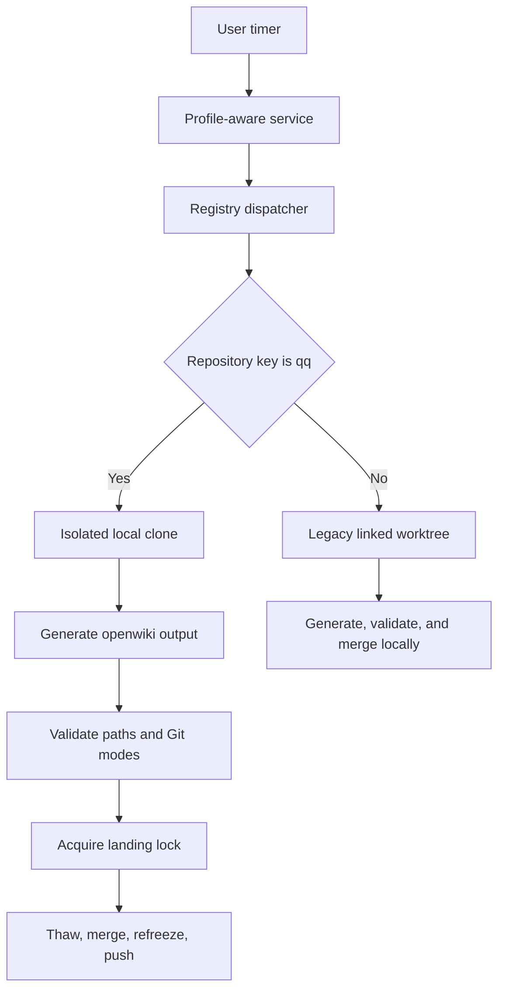

# OpenWiki automation and publication

OpenWiki has two independent automation families: a local user timer that updates several repositories, and a GitHub Actions workflow that proposes a pull request. The local `qq` route is the only route that directly publishes and pushes this repository's generated `openwiki/` tree.

## Local scheduled flow

`qq-openwiki.timer` starts at 04:00, 12:00, and 20:00 local time. It is not persistent, so missed runs are not replayed. The oneshot service has a six-hour timeout, a restrictive umask, and runs as the current user.

`qq-openwiki-service` reads the `openwiki` execution profile. It accepts only `openai-codex` with `medium` effort, maps that provider to OpenWiki's `openai-chatgpt`, exports the configured model, and starts the dispatcher. See [profiles and activation](../runtime/profiles-and-activation.md) for policy ownership.

The registry currently selects `qq`, `qq-newspaper`, `herdr`, `discuss`, and `qq-dictation`. Entries can be project keys below `$HOME/projects` or absolute repository paths. The dispatcher validates every repository first, runs at most three by default, prefixes output with the repository key, waits for every started job, and fails after all jobs finish if any job failed.



*The local scheduler routes `qq` through isolated publication and other registered repositories through the legacy worktree path.*

## `qq` isolated-clone path

`bin/qq-openwiki-refresh` is both writer coordinator and publication gate:

1. Require the configured repository key to equal the published key (`qq` by default), a clean `main` checkout, and an existing local `main` branch. Freeze existing generated output before doing work.
2. Take the non-blocking repository lock `.git/qq-openwiki-refresh.lock`. A concurrent refresh reports that it is already running and exits successfully.
3. Create a disposable, local, single-branch clone. Remove its remote, choose `init` or `update` from `openwiki/.last-update.json`, and run `openwiki code --<action> --print` there. Root-file rewrites in the clone never become writer changes because the script resets to the source revision and stages only `openwiki`.
4. Require `openwiki` to be a regular directory containing only regular files and directories. Reject an empty writer, any changed path outside `openwiki/*`, whitespace errors, or any generated Git entry other than a `100644` blob.
5. Commit the generated tree and pass the exact writer commit to `qq-openwiki-publish`.

The publisher independently repeats repository-key, ancestry, single-parent, path, and mode checks. Under the blocking shared `.git/qq-land.lock`, it then requires clean `main`, a configured upstream, current ancestry, and a clean trial merge in the disposable clone. Only after those checks does it import the writer objects, thaw the live tree, create a no-fast-forward merge, refreeze, and push the merge commit. This lock is shared with delegated landing; see [delegation and review](../workflow/delegation-and-review.md).

Generation does not hold the landing lock, so normal work can continue. If `main` moves or becomes dirty, publication is deferred rather than overwriting operator work. A conflicting advance is rejected before the live merge. A failure after thaw triggers best-effort refreezing; a failed refreeze makes the operation fail. The disposable clone is always removed.

## Generated-tree ownership and modes

The automation owns committed paths below `openwiki/`. Normal agents should treat that tree as generated output:

- `qq-openwiki-materialize freeze REPOSITORY` sets directories to `0555` and files to `0444`; `thaw` restores `0755` and `0644`.
- The materializer rejects a symlinked output root and any entry that is not a regular file or directory.
- Writer commits retain Git mode `100644`; filesystem read-only permissions are a local materialization policy, not executable Git modes.
- Delegation freezes generated output around worktree setup and cleanup. Review rejects delegated proposals that change generated OpenWiki paths instead of silently thawing them.
- Only the publisher thaws the live `qq` tree, and it does so while holding `qq-land.lock`.

## Legacy repository path

`bin/qq-openwiki-refresh-legacy` serves every registered key except `qq`:

- It uses a persistent state location of `$XDG_STATE_HOME/qq/openwiki/<key>/worktree`, but creates a fresh linked worktree and temporary branch for each run and removes both on exit.
- Its non-blocking per-repository lock is `.git/qq-openwiki.lock`, distinct from the `qq` refresh lock.
- It preloads `qq-openwiki-shell-env.cjs`, which repairs shell spawns that pass an empty environment by preserving only `PATH`, `HOME`, `TMPDIR`, `LANG`, and `LC_ALL` when present.
- Before generation it rejects symlinked `.github` or `.github/workflows` ancestors and unlinks symlinked `AGENTS.md`, `CLAUDE.md`, or `.github/workflows/openwiki-update.yml` inside the disposable worktree. After generation it restores tracked setup files or removes untracked ones, then accepts changes only below `openwiki/`. This prevents a generator setup rewrite from following a tracked absolute symlink into another live repository.
- It takes the shared blocking `qq-land.lock`, rechecks clean `main`, verifies a trial merge, and merges locally with `--no-ff`. Unlike the `qq` publisher, this script does not push and does not apply read-only materialization.

Both local routes choose `init` when `.last-update.json` is absent and `update` when it exists; `QQ_OPENWIKI_ACTION` can force `auto`, `init`, or `update`. Both refuse dirty or wrong-branch main checkouts and preserve an unchanged run as a no-op.

## GitHub pull-request path

`.github/workflows/openwiki-update.yml` runs daily at 08:00 UTC or by manual dispatch. It checks out full history, installs Node 22 and pinned `openwiki@0.3.2` plus Mermaid validation dependencies, then runs `openwiki code --update --print` with OpenRouter model `z-ai/glm-5.2`. Connector and tracing credentials come from repository secrets.

This route does **not** use the local execution profile, registry, filesystem modes, refresh locks, `qq-land.lock`, isolated publisher, direct merge, or direct push to `main`. Instead, `create-pull-request` maintains branch `openwiki/update`. Its explicit PR path allowance is broader than local publication: `openwiki`, `AGENTS.md`, `CLAUDE.md`, and the workflow file itself. Human or branch-policy review remains the publication boundary.

## Failure routing

| Symptom | Boundary and action |
|---|---|
| Unsupported provider or effort | Fix the `openwiki` execution profile; the service refuses to dispatch. |
| Missing, empty, malformed, or unavailable registry entry | Fix `config/openwiki-repositories` or the project checkout; dispatch stops before launches complete. |
| “refresh is already running” | Another same-repository writer holds the non-blocking refresh lock; no action is normally needed. |
| Dirty or wrong-branch `main` | Preserve the operator change, return to clean configured `main`, then rerun. Nothing is stashed. |
| Non-generated path, special entry, executable generated blob, or symlinked legacy setup ancestor | Treat as unsafe generator/output topology; publication is rejected before the generator can mutate an external target. |
| Main changed or merge no longer clean | Regenerate from current `main`; do not force the writer commit. |
| Push failure after merge | Inspect local `main` and upstream before retrying; the local merge may already exist. |
| One dispatched repository fails | Other started jobs still finish; service exits non-zero after aggregation. |
| GitHub update fails | Inspect the Actions run and secrets; it has no effect on the local timer or direct publisher. |

## Focused validation

Run from the repository root:

```bash
tests/test-openwiki-service.sh
tests/test-openwiki-dispatch.sh
tests/test-openwiki-refresh.sh
tests/test-openwiki-refresh-legacy.sh
node --experimental-strip-types tests/test-delegation.mjs .
node --experimental-strip-types tests/test-review-flow.mjs .
```

The four OpenWiki suites use temporary repositories and fake generators. They cover profile mapping, schedule shape, registry routing and bounded parallelism, no-op/update behavior, path and mode rejection, lock ordering, race preservation, merge conflicts, cleanup, push behavior, legacy root-file suppression, symlinked setup-ancestor rejection, and containment when a legacy repository tracks an absolute setup-file symlink into live `qq`. Delegation/review tests cover read-only materialization and rejection of generated-path proposals. See [practical validation](../testing/validation.md) for prerequisites and live-test boundaries.

## Evidence

Primary sources: `bin/qq-openwiki-{service,dispatch,refresh,publish,refresh-legacy,materialize}`, `bin/qq-openwiki-shell-env.cjs`, `config/openwiki-repositories`, `systemd/user/qq-openwiki.{service,timer}`, and `.github/workflows/openwiki-update.yml`.

Primary tests: `tests/test-openwiki-{service,dispatch,refresh,refresh-legacy}.sh`, `tests/test-delegation.mjs`, and `tests/test-review-flow.mjs`.
